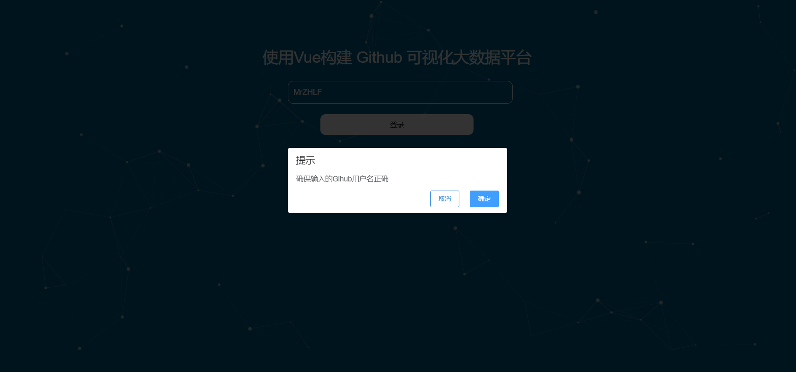
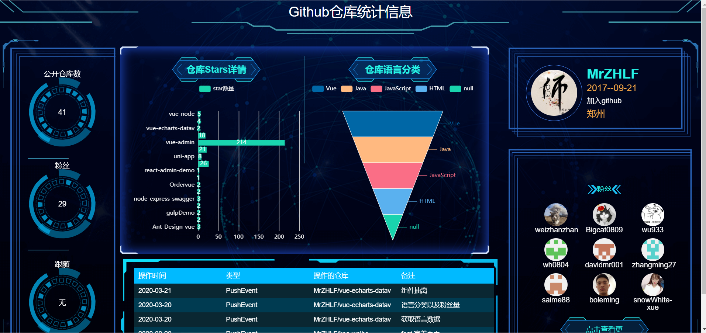

# vue-echarts-datav

- 使用 vue 结合 v-charts 和 datav 实现一个可视化界面数据展示，所有的接口来源，来自 GitHub 中提供的数据信息

### 项目构建

- 克隆仓库
  `https://github.com/MrZHLF/vue-echarts-datav.git`
- 进入目录里面
  `cnpm install`
- 启动
  `cnpm run dev`

## 项目结构

```
	|——— public  #发模式下静态资源目录
	|    |——— favicon.ico  #图标
	|    |——— index.html    #首页入口文件，你可以添加一些 meta 信息或同统计代码啥的
	|——— node_modules #一些常用安装的依赖
	|——— src #前端项目源码目录
  |	   |——— common  #公共文件
  |	   |——— components  #公共组件
  |	   |     ———— app-header  #头部
  |	   |     ———— fans  #获取粉丝
  |	   |     ———— lately  #操作记录
  |	   |     ———— user  #个人信息
  |	   |     ———— warehouse  #仓库Stars详情和仓库语言
	|	   |——— styles  #静态scss文件
  |	   |——— views  #组件
  |	   |     ———— center  #右边展示内容
  |	   |     ———— login  #登录页面
  |	   |     ———— Home.vue  #主页面
  |	   |——— assets  #静态文件
	|    |——— router  #路由目录
	|    |——— store   #数据状态管理
	|    |——— App.vue #项目入口文件
	|    |——— main.js #项目核心文件
	|——— package.json #项目配置文件
	|——— babel.config.js #babel配置文件
	|——— vue.config.js #vue配置文件
	|___ README.md    #项目的说明文档

```

### 实现功能

- [x] 用户登录以及个人信息展示
- [x] 公开仓库
- [x] 仓库 Stars 详情
- [x] 仓库语言详情
- [x] 粉丝数量以及粉丝展示
- [x] 最近操作记录

### 请求接口介绍

- 请求个人信息接口 `https://api.github.com/users/用户名`
- 请求粉丝接口 `https://api.github.com/users/用户名/followers`
- 仓库信息 `https://api.github.com/users/用户名/repos`
  - 这个接口里面包含个人仓库所有信息
- 包含提交信息 `https://api.github.com/users/用户名/events`

### 成果展示




